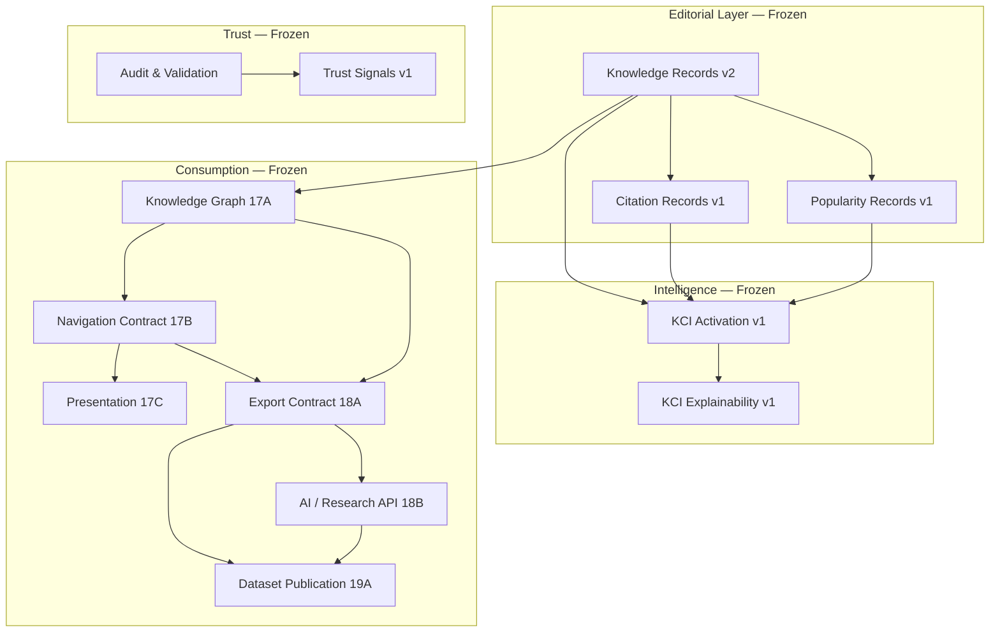

# NameOrigin.io Platform Certification v1.0

_Canonical technical specification for the completed deterministic knowledge platform._

**Certification date:** 2026-08-06  
**Platform version:** 1.0  
**Corpus size:** 3,697 entities  
**Primary dataset release:** `18A-v1`  
**Status:** Architecture complete — platform engineering frozen

This document certifies that NameOrigin.io has completed its planned platform architecture. All computational layers below publication are frozen. Future work operates on **dataset versions**, not infrastructure.

---

## Certification statement

NameOrigin.io is certified as a **deterministic knowledge platform** with:

- A fully researched editorial corpus (3,697 Knowledge Records)
- Frozen editorial, citation, and popularity record layers
- A read-only relationship graph and navigation contract
- Presentation, export, API, and publication layers that consume explicit contracts only
- Deterministic validation at every layer
- Versioned dataset publication with checksum verification

No downstream layer modifies an upstream layer. Every dependency flows in one direction.

---

## Platform architecture



---

## Era completion

| Era | Status | Outcome |
| --- | --- | --- |
| **Foundation** | Complete | Knowledge Records v2, Citation Infrastructure, Popularity Infrastructure |
| **Intelligence** | Complete | KCI scoring (avg 93.05), explainability presentation |
| **Trust** | Complete | Audits, transparency pages, validation protocols |
| **Expansion** | Complete | 3,697 fully researched Knowledge Records (Wave 2) |
| **Consumption** | Complete | Graph, Navigation, Presentation, Export, API, Publication |

---

## Lifecycle timeline

| Phase | Layer | Version | Status |
| --- | --- | --- | --- |
| 6A | Knowledge Record | v2.0 | Frozen |
| 8A–8B | Citation | v1.0 | Frozen |
| 9A–9B | Popularity | v1.0 | Frozen |
| 10A | KCI Activation | v1 | Frozen |
| 11A | KCI Explainability | v1 | Frozen |
| 12A | Trust Signals | v1 | Complete |
| 15B Wave 2 | Editorial Expansion | — | Complete (3,697 KR) |
| **17A** | Knowledge Graph | 17A-v1 | **Frozen** |
| **17B** | Navigation Engine | 17B-v1 | **Frozen** |
| **17C** | Relationship Presentation | 17C-v1 | **Frozen** |
| **18A** | Structured Exports | 18A-v1 | **Frozen** |
| **18B** | AI / Research API | v1 | **Frozen** |
| **19A** | Dataset Publication | 19A-v1 | **Frozen** |

Operating model for all layers:

```
Build → Validate → Freeze → Expose → Publish
```

---

## Frozen contracts

### Editorial contracts

| Contract | Location | Schema | Records |
| --- | --- | --- | --- |
| Knowledge Records | `data/knowledge-records.json` | v2.0 | 3,697 |
| Citation Records | `data/citation-records.json` | v1.0 | 3,697 |
| Popularity Records | `data/popularity-records.json` | v1.0 | 5 |

### Consumption contracts

| Contract | Location | Version | Purpose |
| --- | --- | --- | --- |
| Knowledge Graph | `data/graph/` | 17A-v1 | Relationship derivation |
| Navigation Contract | `data/navigation/` | 17B-v1 | Navigation indexes |
| Export Contract | `exports/` | 18A-v1 | Machine-readable datasets |
| Published Release | `releases/18A-v1/` | 19A-v1 | External distribution |

### Public interfaces

| Interface | Consumers | Rule |
| --- | --- | --- |
| **Navigation Contract** | Presentation (17C), UI | Never read `data/graph/` directly |
| **Export Contract** | API (18B), research tools, publication (19A) | Never read internal `data/` directly |

---

## Dependency graph

```
Knowledge Records (Frozen)
        │
        ├── Citation Records (Frozen)
        ├── Popularity Records (Frozen)
        │
        ▼
KCI Engine (Frozen, read-only scoring)
        │
        ▼
KCI Explainability (Frozen, presentation)
        │
Knowledge Graph Engine (17A, Frozen)
        │
        ▼
Navigation Engine (17B, Frozen)
        │
        ├── Relationship Presentation (17C, Frozen)
        │
        ▼
Export Engine (18A, Frozen)
        │
        ├── AI / Research API (18B, Frozen)
        │
        ▼
Dataset Publication (19A, Frozen)
```

**Invariant:** No arrow points upward. Downstream layers are read-only consumers.

---

## Validation summary

All consumption-layer audits report **PASS** with zero validation errors.

| Layer | Audit artifact | Validation |
| --- | --- | --- |
| Knowledge Graph (17A) | `audit/knowledge-graph.json` | PASS |
| Navigation (17B) | `audit/navigation.json` | PASS |
| Presentation (17C) | `audit/relationship-presentation.json` | PASS |
| Structured Exports (18A) | `audit/structured-exports.json` | PASS |
| AI / Research API (18B) | `audit/api.json` | PASS |
| Dataset Publication (19A) | `audit/publication.json` | PASS |
| KCI | `audit/knowledge-completeness.json` | Complete (3,697 entities) |

Cross-layer frozen-layer checks confirm editorial, graph, navigation, export, and API artifacts remain unchanged during downstream generation.

---

## Semantic hashes (reproducibility anchors)

These hashes verify deterministic rebuilds at each frozen layer:

| Layer | Semantic hash |
| --- | --- |
| Knowledge Graph (17A) | `5cc6f2594d1172e915f32284c78e0d9a9f04a06669e1756fa6f82b2e43c79156` |
| Navigation (17B) | `876f9628d5b8100811fb102b1c92816641beb1ab24ac50ef57ee56461b024b82` |
| Presentation (17C) | `fc381a99ea6102afa48733c4bcd2595c221005f8c52d4a7cb3ab8801d90c71b2` |
| Export Contract (18A) | `229318105314bda7bb7f66c5271f782b8823ac9adf031d14eb29790f4967c5ab` |
| AI / Research API (18B) | `f7bec6b93c3ff71fe7f9c048adf0d8877353332e95c4845e4641757ddccfdd85` |
| Dataset Publication (19A) | `91c5f6ff398fc9cb07810bffdd0eca35f16af44b7f7444f073c8178f978b9a2a` |

---

## Reproducibility guarantees

1. **Deterministic builds** — Identical inputs produce identical semantic hashes at every layer.
2. **Frozen upstream layers** — Each build verifies SHA-256 hashes of upstream artifacts before and after generation.
3. **No hidden computation** — Presentation, export, API, and publication layers perform lookup and serialization only.
4. **Checksum verification** — Published releases include `checksums.sha256` for independent verification.
5. **Versioned endpoints** — API responses include `apiVersion`, `datasetVersion`, and `semanticHash`.
6. **Audit trail** — Every layer writes a committed audit artifact under `audit/`.

Regeneration pipelines (local development):

```bash
# Graph → Navigation
node scripts/build/generate-knowledge-graph.js
node scripts/build/validate-knowledge-graph.js
node scripts/build/generate-navigation.js
node scripts/build/validate-navigation.js

# Presentation
node scripts/build/generate-relationship-presentation.js
node scripts/build/validate-relationship-presentation.js

# Export → API → Publication
node scripts/build/generate-structured-exports.js
node scripts/build/validate-structured-exports.js
node scripts/build/generate-api-indexes.js
node scripts/build/validate-api.js
node scripts/build/generate-publication.js
node scripts/build/validate-publication.js
```

---

## Dataset statistics

### Editorial corpus

| Metric | Value |
| --- | --- |
| Knowledge Records | 3,697 |
| Citation Records | 3,697 |
| Popularity Records | 5 |
| Average KCI score | 93.05 |
| Domain coverage | 100% (all entities researched) |

### Knowledge graph (17A)

| Metric | Value |
| --- | --- |
| Nodes | 3,697 |
| Edges | 23,737 |
| Average degree | 12.84 |
| Disconnected components | 3 |

### Navigation (17B)

| Metric | Value |
| --- | --- |
| Entities with navigation | 3,697 |
| Average related names | 8.16 |
| Origin explorer groups | 36 |
| Language explorer groups | 62 |
| Meaning explorer groups | 582 |
| Pronunciation explorer groups | 114 |
| Cultural explorer groups | 187 |

### Presentation (17C)

| Metric | Value |
| --- | --- |
| Name pages updated | 3,697 |
| Explorer pages | 981 |
| Related name cards | 30,172 |
| Broken links | 0 |

### Export Contract (18A)

| Metric | Value |
| --- | --- |
| Export artifacts | 19 |
| Formats | JSON, JSONL, CSV |

### AI / Research API (18B)

| Metric | Value |
| --- | --- |
| API version | v1 |
| Static JSON responses | 8,289 |
| Entity endpoints | 3,697 |

### Published release `18A-v1` (19A)

| Metric | Value |
| --- | --- |
| Packaged files | 8,313 |
| Total bytes | 135,090,075 (~135 MB) |
| SHA-256 checksums | 8,313 |
| Validation | PASS |

Verify a published release:

```bash
shasum -a 256 -c releases/18A-v1/checksums.sha256
```

---

## Governance principles

1. **Single direction of dependency** — Downstream layers consume upstream contracts; never mutate them.
2. **Explicit contracts** — Navigation Contract and Export Contract are the only supported public interfaces.
3. **Determinism over heuristics** — No ML, randomness, or popularity weighting in relationship or navigation layers.
4. **Absence is null** — Missing knowledge is represented as null, not invented prose.
5. **Audit before freeze** — Every layer requires PASS validation before architectural freeze.
6. **Version everything** — API (`/api/v1/`), exports (`18A-v1`), and publications (`19A-v1`) are explicitly versioned.
7. **Publication is packaging** — Dataset releases copy frozen artifacts; they do not regenerate knowledge.

---

## Release lineage (v2 → 19A)

| Milestone | Architecture version | Phase | Role |
| --- | --- | --- | --- |
| Knowledge Architecture | v2 | 6A | Editorial source of truth |
| Citation Infrastructure | v1 | 8A | Publication registry |
| Citation Population | v1 | 8B | Entity citations |
| Popularity Infrastructure | v1 | 9A | Source registry |
| Popularity Population | v1 | 9B | Entity popularity |
| KCI Activation | v1 | 10A | Deterministic scoring |
| KCI Explainability | v1 | 11A | Name page presentation |
| Trust Signals | v1 | 12A | Transparency pages |
| Editorial Expansion | — | 15B Wave 2 | Full corpus (3,697 KR) |
| Knowledge Graph Engine | 17A-v1 | 17A | Relationship derivation |
| Navigation Engine | 17B-v1 | 17B | Navigation indexes |
| Relationship Presentation | 17C-v1 | 17C | HTML presentation |
| Structured Export Engine | 18A-v1 | 18A | Machine exports |
| AI / Research API | v1 | 18B | Query facade |
| Dataset Publication | 19A-v1 | 19A | Versioned releases |

---

## What changes from this point forward

Platform engineering is **complete**. Future work is **platform operations**:

| Activity | Type | Example |
| --- | --- | --- |
| New dataset versions | Publication | `18A-v2`, `19A-v2` |
| Corpus expansion | Editorial | New Knowledge Records via frozen Wave 2 pipeline |
| New authoritative sources | Editorial | Additional citation registry entries |
| Language coverage | Editorial | New origin/language clusters |
| Contract increments | Versioning | API v2, Export Contract v2 (breaking changes only) |

Future releases are **dataset releases**, not architecture releases.

---

## Canonical references

| Topic | Document |
| --- | --- |
| Knowledge Graph | `docs/KNOWLEDGE_GRAPH.md` |
| Navigation Engine | `docs/NAVIGATION_ENGINE.md` |
| Relationship Presentation | `docs/RELATIONSHIP_PRESENTATION.md` |
| Structured Exports | `docs/STRUCTURED_EXPORTS.md` |
| AI / Research API | `docs/AI_RESEARCH_API.md` |
| Dataset Publication | `docs/DATASET_PUBLICATION.md` |
| Architecture history | `docs/ARCHITECTURE_VERSION_HISTORY.md` |
| Wave 2 governance | `docs/WAVE2_GOVERNANCE.md` |
| Platform certification audit | `audit/platform-certification.json` |

---

## Engineering objective — realized

NameOrigin.io has evolved from a collection of generated pages into a **deterministic knowledge platform** with:

- Frozen editorial architecture
- Explainable intelligence (KCI)
- Trust and audit transparency
- Complete editorial corpus
- Machine-consumable graph, navigation, export, and API contracts
- Versioned dataset publication

**Platform Certification v1.0 — Architecture Complete.**
